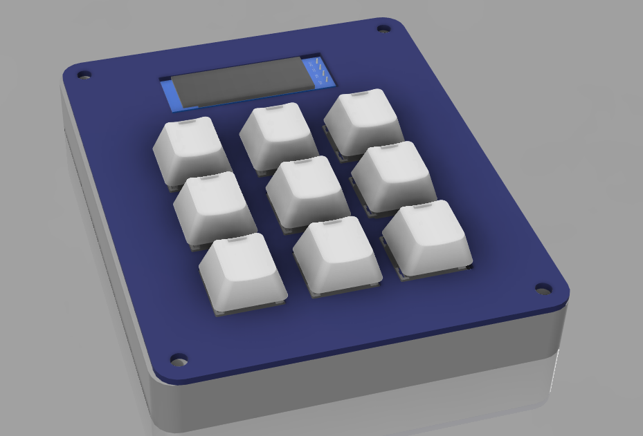

# Gethin HackPad v1

This repository contains all files for my **AMD x HackClub Macropad** project.  
The macropad is designed for computer shortcuts, python programming, and game controlling.  

It features:
- 3x3 mechanical keys
- 0.91" OLED display
- Powered by a Seeed XIAO RP2040 microcontroller

---

## 📸 Hackpad Overview

This is the overview of my hackpad assembled in Fusion 360 which shows how it should be all put together

---

## 🔌 Schematic
 

This is my schematic that I designed in KiCad showing which components I'm using and how they are connected. As you can see, each key switch is wired seperately to the RP2040 and the OLED is orded in GND-VCC-SCL-SDA so that it is compatible with the 0.91" display sent by HackClub

---

## 🖥️ PCB Layout
This is my PCB layout that I designed in the KiCad PCB Designer. It shows all of the component placement and copper wiring so I can visualise all the connections. I also added some customisation on the silkscreen such as a link to this github repository & the name of my Hackpad

---

## 🧩 Case Design

Base & cover designed in Fusion360

---

## 📦 Bill of Materials (BOM)
List of all parts used in my hackpad:

| Part | Quantity | Description | 
|------|----------|-------------|
| Mechanical Key Switches | 9 | MX-style switches |
| Cherry Keycaps | 9 | Compatible with MX switches | 
| Seeed XIAO RP2040 | 1 | Microcontroller | 
| OLED Display 0.91" | 1 | I2C interface | 
| PCB | 1 | Double-sided | 
| Case | 1 | 3D printed (prob PLA)| 

---

## Firmware Instructions:

1. Download & install CircuitPython .uf2
2. Connect the Seeed XIAO RP2040 via USB and enter bootloader mode
3. Flash the MCU with the .uf2

Libraries:
1. Download CircuitPython library bundle & unzip
2. Copy displayio, display_text, debouncer & hid to the MCU
3. Upload the `code.py` to the XIAO
4. Test

## 📝 License
This project is open-source under the MIT License.

